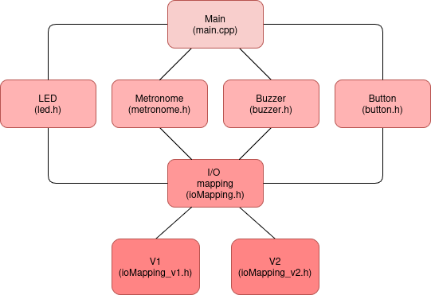

# Metronome Project
## Demo of the current prototype

https://github.com/user-attachments/assets/ab10ca27-0545-46ae-9c20-4c6e0ad22866

## Introduction

This repo provides the implementation of a digital metronome using the ATmega328p independent of the board configuration. To choose a particular version of the board, with the particular choice of input and output ports set a compiler flag as shown in the `ioMapping.h` file.

> Side Note: an implementation using the NUCLEO-F401RE can be found in the folder `Implementation on NUCLEO-F401RE`.

Required hardware:
- Buttons: To change the BPM of the metronome (one to increase the BPM and another one to decrese it).
- LED: Shows the metronome's pulse.
- Buzzer: to create the click of the metronome.
- Display **(to be implemented in the future)**: displays the current BPM of the metronome.

 

*Figure 1: Digital Metronome Architecture*

Interesting features of the implementation:
- Button Debouncing: Using a timer to periodically check the status of the button. If a certain number of samples agree that the button was pressed then the event *"button_pressed"* is aknowledged.
- Metronome tick according to a timer.
- Now the user can choose between the following BPM's by pressing the button: [60, 70, 80, 90, 100, 110, 120, 130, 140, 150, 160].

## Using the Arduino Uno (ATmega328P)

Hardware interface specified in the ioMapping_v1.h and ioMapping.h files. 

Ex for the version 1 of the board (`ioMapping_v1.h`)
Required hardware:
- Buttons: 
    - Button to increase the BPM: Pin D9, which corresponds to the pin PB1 in the microcontroller. The timer 0 requests checking the reading periodically (once every ms) and the pressed state is validated by `threshold_debouncing` consistent readings.
    - Button to decrease the BPM: Pin D10, which corresponds to the pin PB2 in the microcontroller. The timer 0 requests checking the reading periodically, in the same way as for the other button.
- LED: Pin D13, which corresponds to the pin PB5 in the microcontroller. The timer 1 toggles the LED.
- Buzzer: Pin D8 which corresponds to the pin PB0 which in the microcontroller. The timer 1 toggles the Buzzer.

- Display: using a 16x2 LCD screen communicating via I2C. Currently using a [third party library](https://github.com/johnrickman/LiquidCrystal_I2C/tree/master)

> Note that the LED and the buzzers are toggled by Timer 1. This means that for a full click cycle (ON and OFF states), Timer 1 needs to tick twice: once to turn them on and once to turn them off. **This means that the frequency of Timer 1 is twice the frequency of the metronome**.

### Usage
Set the compiler flag in the `platformio.ini` before building the project with the following:

```
build_flags = -DCOMPILING_FOR_V1
``` 
