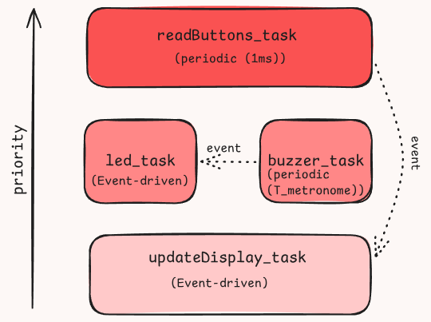

# Metronome Project
## Demo of the current prototype

## Introduction

This repo builds on my previous project  [Digital-Metronome](https://github.com/Guillermp/Digital-Metronome) but I tried to use an RTOS for a more organized system and to get some practical experience.
> Side Note: I'm going quite far to avoid using metronome apps on my phone haha. They are both anoying to use and normally ask you to pay a subscription to not get adds. In addition, I feel like the user experience is way better with a physical metronome in general.

Interesting features of the implementation:
- Button Debouncing: Using a timer to periodically check the status of the button. If a certain number of samples agree that the button was pressed then the event *"button_pressed"* is aknowledged.
- Now the user can choose between the following BPM's by pressing the button: (from 40 to 250 BPM with increments of 10 BPMs).
- I changed the board to an esp32-c3-devkitm-1

## Using FreeRTOS

Figure: Visual organization of tasks.

- Periodic tasks with different priority:
	- `readButtons_task`: checks whether the button is pressed and, if it passes the debouncing condition (5 consistent pressed values), considers the button pressed, updates the BPM, and writes it to the display queue. This event unblocks the `updateDisplay_task` 
    - `buzzer_task`: it notifies the led_task to unblock, plays a tone, and waits to complete the period needed to achieve the desired BPM.

- Event-driven tasks (blocked until they are needed):
	- `updateDisplay_task`: Blocks until a BPM value is available in the display queue, then updates the LCD.
    - `led_task`: It makes the LED blink. It waits for the buzzer to indicate a pulse to turn it on. And turns it off after 30 ms.